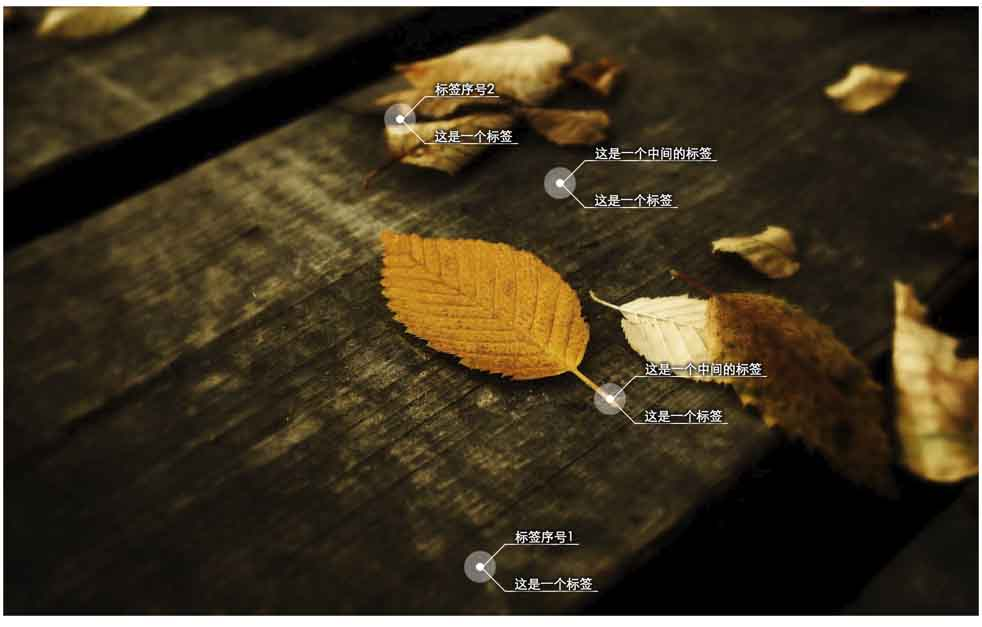

## Tags
###一个简单的用于给图片打tag的JS插件
####正在完善中....
<a href="http://dejun-github-tag.oss-cn-qingdao.aliyuncs.com/">Demo</a>

####可选参数
<li>direction</li>
<li>tag_name</li>
<li>link_name</li>
<li>分叉数目</li>
###必选值
<li>tag相对于图片的位置,left&top取值范围（0,1）</li>

